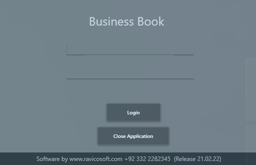
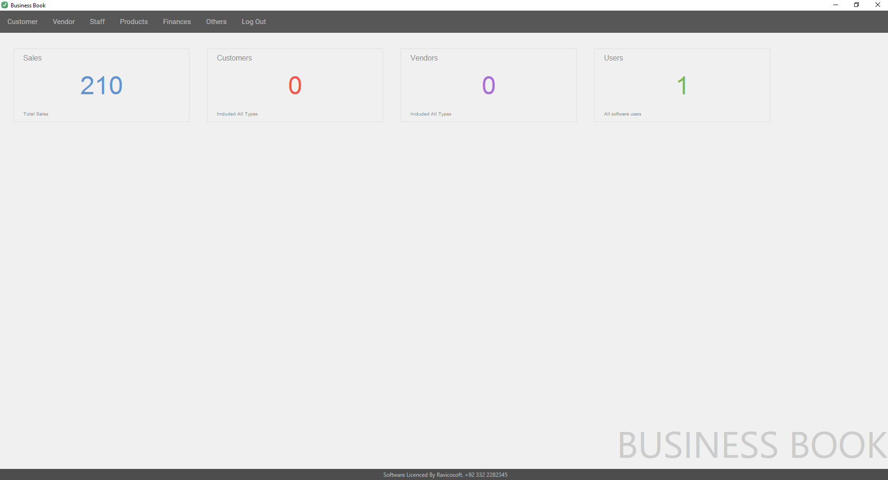
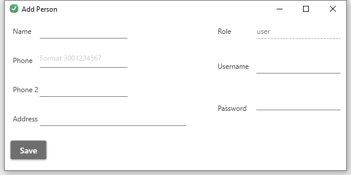

# FreePOS-Point Of Sales
Window based open source Point of sales built with c#, wpf and mysql 

## Installation

Install mysql database, then download the [freepos installer](https://github.com/ravicosoftltd/FreePOS/releases) and run

### Features

* All standard features for Point of sales
* Inventory
* Accounting
* Customers and Vendors Ledger
* Multiple users
* Invoice printing
* Reporting
* Send Branded SMS from software
* No Data limits
* Easy to learn and use
* C# WPF and MySql based latest stack
* 100% free and open source
* And much more

### Some Sreenshots

### Requirements
* .Net framework >= 4.5
* Mysql >= 5.6

## Contributing / Reporting issues

Create pull request or raise issues and start contributing

## License

[Apache License, Version 2.0](http://www.apache.org/licenses/LICENSE-2.0.html)

More information is available at [freepos.pk](https://freepos.pk).
